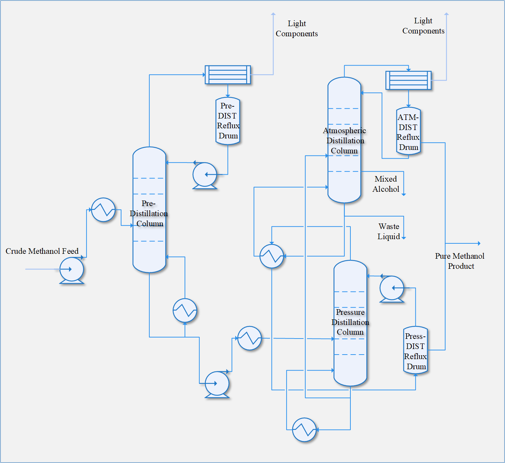

# DIST Dataset

## Dataset Description

The DIST dataset originates from a methanol distillation process within a chemical plant, encapsulating a month's 
worth of distributed control system (DCS) data. It offers a granular snapshot of operational dynamics through 
a variety of process and control parameters, essential for understanding the interactions within control loops.
The dataset's value is further enhanced by its rich portrayal of real-time variations in system behavior across 
different conditions, serving as a crucial asset for crafting sophisticated process control, fault detection, 
and optimization solutions.

Covering July 1 to August 1, 2023, the DIST dataset consists of 133,920 data points at a 20-second sampling interval,
ensuring high-resolution data collection. Data is collected from 37 sensors at each interval, encompassing 9 process 
variables (PV), 9 operational variables (OP), and 19 monitoring variables.

## Dataset Structure

The data architecture of the dataset is detailed as follows:

1. **`data_array`**:
   - The `data_array` serves as the foundational element of the dataset, encapsulating the sensor-generated data.
   - It adopts a bidimensional array structure, with each row distinctly representing a temporal sampling instance 
   and each column corresponding to a specific sensor variable.
   - The dataset element `data_array[i, j]` holds the value recorded by the j-th sensor at the i-th chronological 
   sampling point.
2. **`time_stamp_array`**:
   - This array contains the time stamps correlated with each data sampling instance in `data_array`.
   - The element `time_stamp_array[i]` aligns with and timestamps the sensor readings in the corresponding 
   `data_array[i, :]`.
   - Reflecting a high-resolution data capture approach, the dataset maintains a consistent 20-second interval 
   between each successive temporal sampling point, offering a detailed chronological progression of the 
   distillation process.
3. **`vars_index_dict`**:
   - This dictionary provides a mapping schema, linking sensor variable names to their respective indices within 
   `data_array`.
   - An entry in `vars_index_dict`, such as `'LIC02.PV': 3`, indicates that data pertaining to LIC02.PV is located 
   in the third column of `data_array`.

## Process Flow Diagram

 The following diagram presents a simplified flowchart of the methanol distillation process. A detailed process flow 
 diagram with specific sensor locations will be published upon obtaining permission from the data source.

## Sensor Variable Description List

| **ID**   | **Description**                                              | **Type** |
| -------- | ------------------------------------------------------------ | -------- |
| FIC05.PV | Pressure Tower T02 Reflux Flow                               | PV       |
| FIC09.PV | Atmospheric Tower T03 Reflux Flow                            | PV       |
| FIC11.PV | Flow of Methanol Pump Outlet after Pre-distillation Tower T01 | PV       |
| LIC02.PV | Level in Reflux Slot V0703 of Pre-distillation Tower T01     | PV       |
| LIC03.PV | Level in Pressure Tower T02                                  | PV       |
| LIC04.PV | Level in Reflux Slot V0704 of Pressure Tower T02             | PV       |
| LIC05.PV | Level in Atmospheric Tower T03                               | PV       |
| LIC06.PV | Level in Reflux Slot V0706 of Atmospheric Tower T03          | PV       |
| LIC12.PV | Level in Water Separator V0713 of Pre-distillation Tower T01 | PV       |
| FIC05.OP | Reflux Flow Adjustment in Pressure Tower T02 Reflux Slot     | OP       |
| FIC09.OP | Reflux Flow Adjustment in Atmospheric Tower T03 Reflux Slot  | OP       |
| FIC11.OP | Level Adjustment in Pre-distillation Tower T01               | OP       |
| LIC02.OP | Level Adjustment in Reflux Slot of Pre-distillation Tower T01 | OP       |
| LIC03.OP | Level Adjustment in Pressure Tower T02                       | OP       |
| LIC04.OP | Level Adjustment in Reflux Slot of Pressure Tower T02        | OP       |
| LIC05.OP | Level Adjustment in Atmospheric Tower T03                    | OP       |
| LIC06.OP | Level Adjustment in Reflux Slot of Atmospheric Tower T03     | OP       |
| LIC12.OP | Level Adjustment in Water Separator of Pre-distillation Tower T01 | OP       |
| TI36.PV  | Conversion Gas Temperature                                   | DV       |
| TI38.PV  | Conversion Gas Temperature                                   | DV       |
| PI03.PV  | Conversion Gas Pressure                                      | DV       |
| FI01.PV  | Feed Flow in Pre-distillation Tower T01                      | DV       |
| TI02.PV  | Feed Temperature in Pre-distillation Tower T01               | DV       |
| TI03.PV  | Top Temperature in Pre-distillation Tower T01                | DV       |
| FI03.PV  | Reflux Flow in Pre-distillation Tower T01                    | DV       |
| PI01.PV  | Top Pressure in Pre-distillation Tower T01                   | DV       |
| PI02.PV  | Kettle Pressure in Pre-distillation Tower T01                | DV       |
| TI05.PV  | Sensitive Plate Temperature in Pre-distillation Tower T01    | DV       |
| TI12.PV  | Top Temperature in Pressure Tower T02                        | DV       |
| PI06.PV  | Top Pressure in Pressure Tower T02                           | DV       |
| TI16.PV  | Sensitive Plate Temperature on Tower Plate in Pressure Tower T02 | DV       |
| PI05.PV  | Kettle Pressure in Pressure Tower T02                        | DV       |
| PI08.PV  | Top Pressure in Atmospheric Tower T03                        | DV       |
| TI25.PV  | Sensitive Plate Temperature on Tower Plate in Atmospheric Tower T03 | DV       |
| PI41.PV  | Measurement of Top Pressure in Atmospheric Tower T03         | DV       |
| TI21.PV  | Top Temperature in Atmospheric Tower T03                     | DV       |
| FI12.PV  | Conversion Gas Flow                                          | 5DV      |

* The ID consists of two parts, separated by a period. The first part represents the circuit and function 
to which the sensor belongs, and the second part represents the category of the sensor. In the first part,
the initial letter indicates the type of controlled variable: F for Flow, P for Pressure, T for Temperature, 
L for Level. The subsequent letters indicate the function of the sensor, where I stands for Indication, 
C for Control. The numeric part represents the circuit number. In the second part, PV stands for Process Variable,
OP for Operational Variable. For example, FIC05.PV represents a Flow sensor with Indication and Control functions, 
numbered 05, and PV indicates that the data set is the value of its process variable.
* Type DV stands for "Disturbance Variable." These are variables that impact the process but are not directly 
controlled within the process control loop. In this context, DV signifies important process variables that 
are external to the control loop, such as temperature, pressure, and gas flow in various parts of the tower.